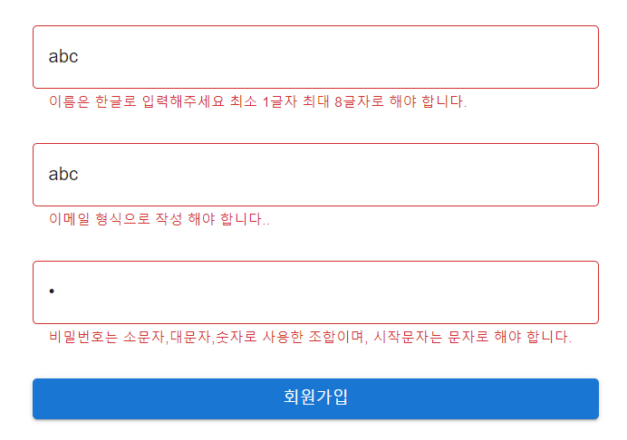
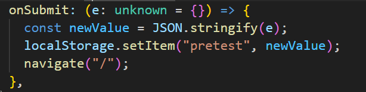
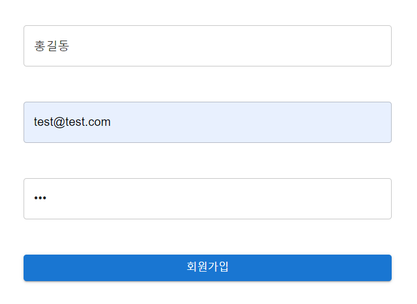
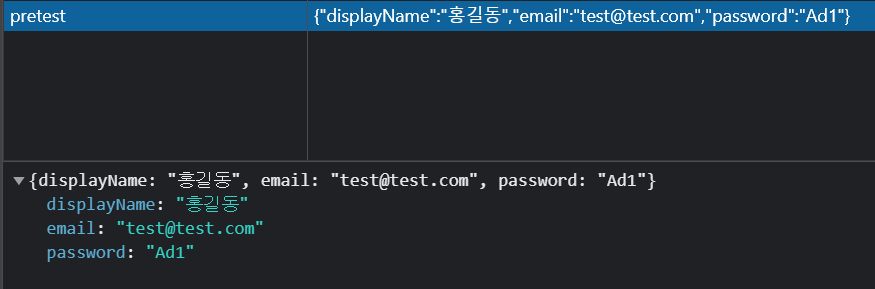
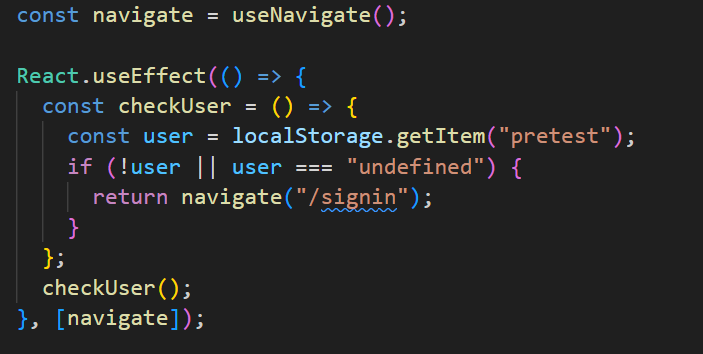
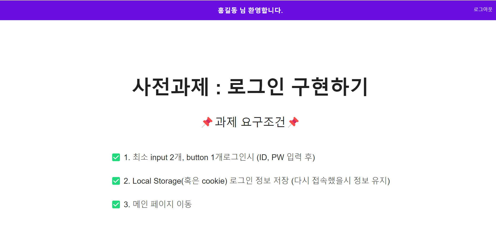

## 📋 사전과제

> 1. 사용자 로그인 구현
> 2. Todo App API 명세서 작성

## 1. 사용자 로그인 구현

### 1. 로그인 컴포넌트 개발

- 아래 요건에 맞춰 사용가능한 framework(react, vue 등) 사용하여 자유롭게 구현해주세요
- README.md 작성해주세요 (과제 관련 내용)
- 개발된 코드는 압축하여 메일로 전달 혹은 github등 링크를 전달해주세요

### 2. 과제 요구조건

- 최소 input 2개, button 1개로그인시 (ID, PW 입력 후)
- Local Storage(혹은 cookie) 로그인 정보 저장 (다시 접속했을시 정보 유지)
- 메인 페이지 이동

> 유효성 검사
>
> - ID : 메일형식
> - PWD : 소문자, 대문자, 숫자 조합 (최소 1개씩) 시작문자는 알파벳

### 3. 구현

#### 1. 프로젝트 구조

```
📦src
 ┣ 📂components // 1. 컴포넌트 폴더
 ┃ ┣ 📜AuthRoute.tsx //
 ┃ ┣ 📜Header.tsx // 헤더
 ┃ ┗ 📜ProtectedRoute.tsx // 원치 않은 도메인 막기
 ┣ 📂context
 ┃ ┗ 📜AuthContext.tsx // 전역상태관리 (유저정보,로그아웃)
 ┣ 📂hooks
 ┃ ┗ 📜useForm.ts // Form 상태관리 커스텀 훅
 ┣ 📂pages
 ┃ ┣ 📜Home.tsx // 메인 페이지
 ┃ ┗ 📜SignIn.tsx // 로그인 페이지
 ┣ 📂utils
 ┃ ┗ 📜validate.ts // 유효성 검사
 ┣ 📜App.tsx // 라우터, Context Providers, Theme Provider
 ┣ 📜index.tsx
 ┣ 📜react-app-env.d.ts
 ┗ 📜reportWebVitals.ts
```

#### 2. Form 상태관리

- `hooks`폴더에서 `useFormController`의 커스텀 훅을 통해 `Form`의 email, password, displayName 등의 `value`들과 `loading`, `error`에 대한 상태관리를 하는 훅입니다.
- 매개변수로 `initialValues`는 초깃값, `onSubmit`는 `submit`할 경우의 콜백 함수, `validate`는 유효성 검사를 위한 함수를 콜백함수로 구성이 됩니다.
- 이 프로젝트에서 `validate` 콜백함수로 `utils/validate.ts`에서 `signInValidation`함수를 사용하였습니다.

\*정규표현식

```ts
// 요구사항 기준 Input

// 이메일 형식 - 이메일 형식 ex) test@test.com
const EMAIL_REGEX =
  /^[0-9a-zA-Z]([-_.]?[0-9a-zA-Z])*@[0-9a-zA-Z]([-_.]?[0-9a-zA-Z])*.[a-zA-Z]{2,3}$/i;

// 비밀번호 형식 - 소문자, 대문자, 숫자로 구성, 맨 앞은 문자 ex) Test1
const PWD_REGEX = /^(?=.*[a-z])(?=.*[A-Z])(?=.*\d)[a-zA-Z\d]+$/;

// 추가 input

// 이름 형식 - 한글로 구성되며, 최소 1글자 에서부터 최대 8글자 ex) 홍길동
const DISPLAY_NAME_REGEX = /^[가-힣]{1,8}$/;
```

- 유효성 검사 함수

```ts
const signInValidation = ({
  displayName,
  email,
  password,
}: SignUpValidationProps) => {
  const errors: SignUpValidationProps = {};

  if (!displayName) {
    errors.displayName = "이름이 입력되지 않았습니다.";
  } else if (!DISPLAY_NAME_REGEX.test(displayName)) {
    errors.displayName =
      "이름은 한글로 입력해주세요 최소 1글자 최대 8글자로 해야 합니다.";
  }

  if (!email) {
    errors.email = "이메일이 입력되지 않았습니다.";
  } else if (!EMAIL_REGEX.test(email)) {
    errors.email = "이메일 형식으로 작성 해야 합니다..";
  }

  if (!password) {
    errors.password = "비밀번호를 입력하지 않았습니다.";
  } else if (!PWD_REGEX.test(password)) {
    errors.password =
      "비밀번호는 소문자,대문자,숫자로 사용한 조합이며, 시작문자는 문자로 해야 합니다.";
  }

  return errors;
};
```

email, password, displayName을 넣어주면 `errors`인 에러 메시지를 담은 객체를 반환하도록 합니다.

\*ex. 에러메시지 예시

```js
{
    "displayName": "이름은 한글로 입력해주세요 최소 1글자 최대 8글자로 해야 합니다.",
    "email": "이메일 형식으로 작성 해야 합니다..",
    "password": "비밀번호는 소문자,대문자,숫자로 사용한 조합이며, 시작문자는 문자로 해야 합니다."
}

```



- `MUI`인 ui 라이브러리의 `<TextField>` 컴포넌트를 사용하여, `error`와 `helperTet`에 props를 주어 에러 메시지가 출력되로고 구현하였습니다.

```ts
return (
  <>
    <TextField
      sx={textStyle}
      fullWidth
      placeholder="이메일을 입력해주세요."
      type="text"
      name="email"
      value={email}
      onChange={handleChange}
      error={!!errors.email}
      helperText={errors.email}
    />
  </>
);
```

- 로컬 스토리지 저장
  
  form 상태관리 훅의 매개변수로 `onSubmit` 콜백 함수를 위 그림과 같이 전달합니다. `pretest`라는 `key`에 `display,name, password`의 객체를 전달하고 `navigate('/')`를 통해서 메인 페이지로 이동합니다.,
  



#### 3. 로그인 상태 유지

- `AuthRoute` 컴포넌트의 기능은 로그인 상태가 되었을 때, 메인 페이지로 이동하게 하고, 로그인 상태가 유지되는 동안 로그인 페이지에 접근할 수 없도록 합니다.
- `ProtectedRoute` 컴포넌트의 기능은 원치 않는 도메인을 막습니다.



- useEffect의 dependency 배열에 `navigate`를 주어, url의 변경을 시도할 때, 페이지가 mount될 떄, `checkUser`함수를 실행하여, 로컬스토리지에 유저 정보가 저장이 되어있지 않다면, 다시 `login` 라우터로 이동을 하도록 합니다.

#### 4. 그 밖의 기능

- `context` 를 사용하여 유저의 정보와 로그아웃 함수 등를 전역상태로 관리하여 재사용이 가능하도록 구현 (`context/AuthContext`)

```ts
const AuthProvider = ({ children }: { children: React.ReactNode }) => {
  const navigate = useNavigate();
  const [userInfo, setUserInfo] = React.useState<UserInfo | unknown>({});

  // 로그아웃시에, 로그인 페이지로 이동
  const logOut = async () => {
    await localStorage.removeItem("pretest");
    setUserInfo({});
    navigate("/signin");
  };

  React.useEffect(() => {
    const userInfo = localStorage.getItem("pretest");
    if (!userInfo) return;
    const parsedUserInfo = JSON.parse(userInfo);
    setUserInfo(parsedUserInfo);
  }, [navigate]);

  return (
    <AuthContext.Provider
      value={{
        userInfo,
        logOut,
      }}
    >
      {children}
    </AuthContext.Provider>
  );
};
export { AuthContext, AuthProvider };
```



## 2. ToDo App API 명세서 작성
